# 🖥️ Windows Server Installation & Domain Controller Setup

This lab demonstrates the complete process of building a **Windows Server 2025 virtual machine**, configuring core server roles, and promoting it to a **Domain Controller (DC01)**.  
It serves as a foundational step in enterprise network management and prepares the environment for Active Directory user, group, and policy management.

---

## 🧩 Overview

This project covers:
- Downloading and configuring a Windows Server VHDX image  
- Importing and setting up the virtual machine in UTM  
- Installing Active Directory Domain Services (AD DS)  
- Promoting the server to a Domain Controller (`DC01`)  
- Verifying domain login with the administrator account  

---

## 🧱 Environment

| Component | Description |
|------------|-------------|
| **Hypervisor** | UTM on macOS |
| **OS Image** | Windows Server 2025 Insider Preview (VHDX) |
| **Domain** | `lab.local` |
| **Hostname** | `DC01` |
| **Role** | Active Directory Domain Controller |
| **Network** | Static IP with DNS set to DC01 |

---

## 🧭 Installation Steps

### 1️⃣ Download and Prepare the Server Image
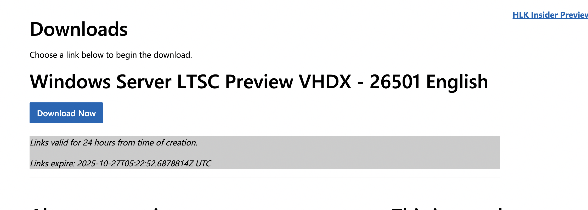

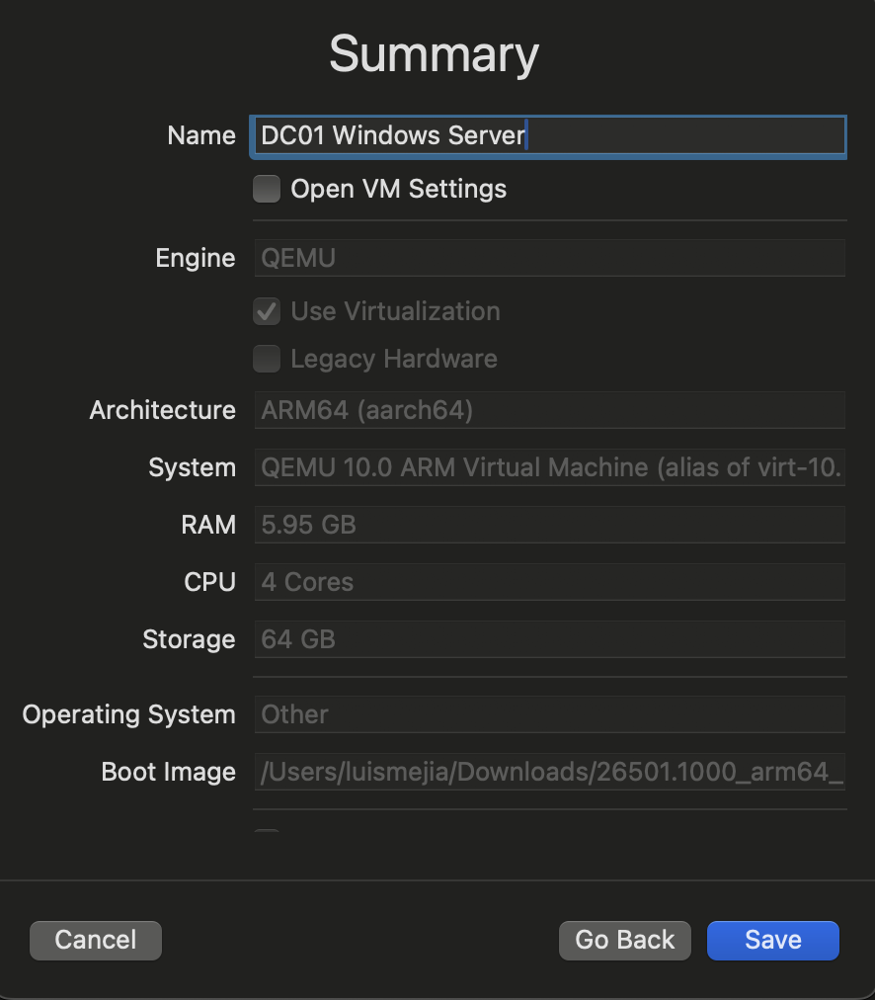

---

### 2️⃣ Begin Installation
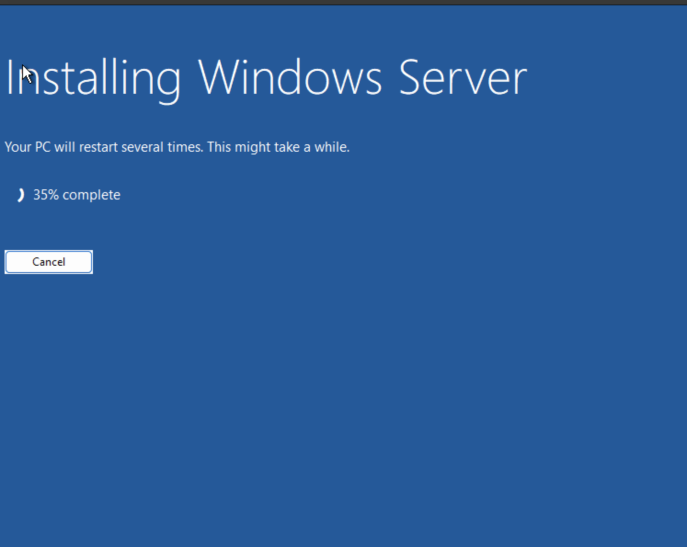
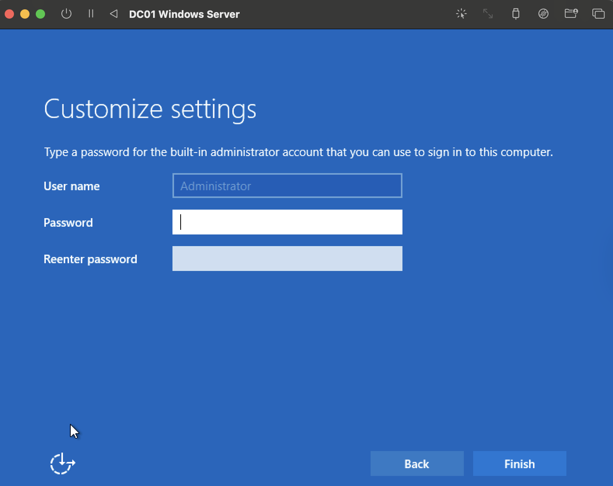
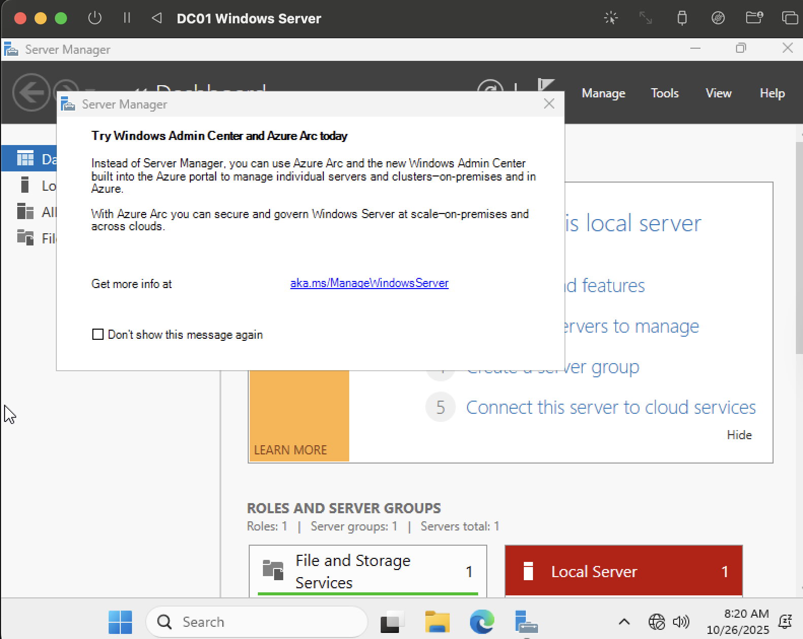

---

### 3️⃣ Build Server ISO and Configure Networking
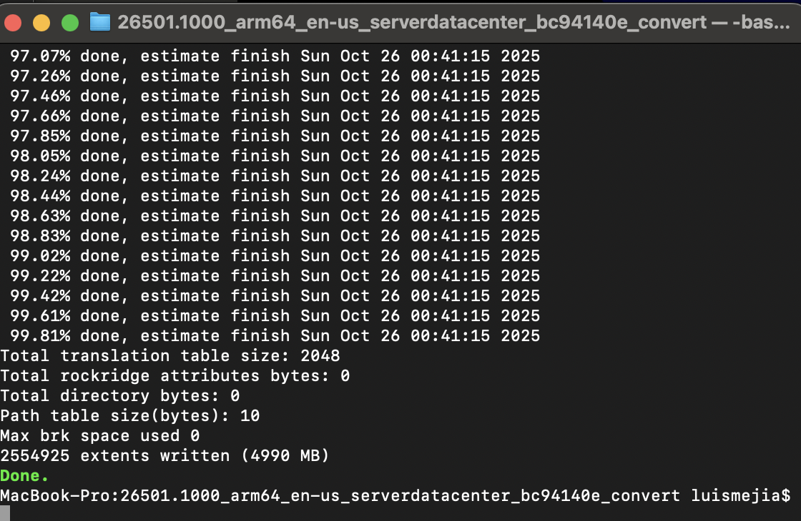
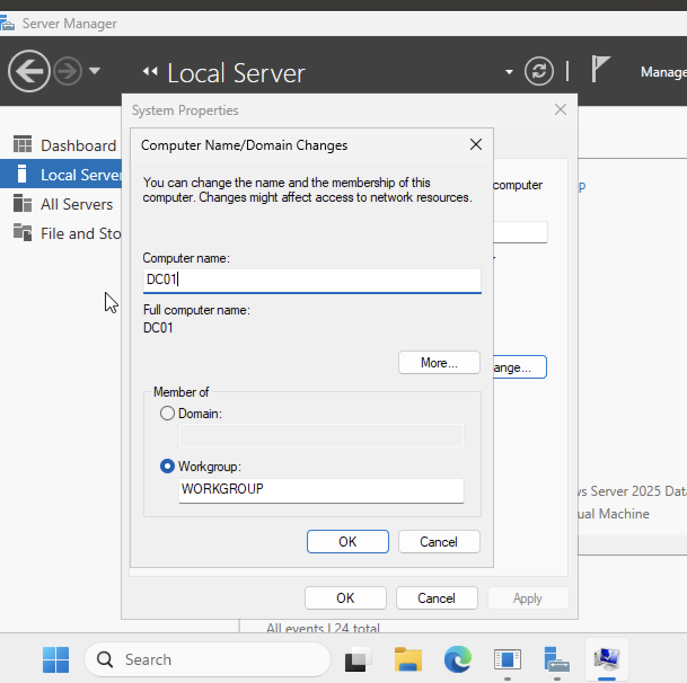
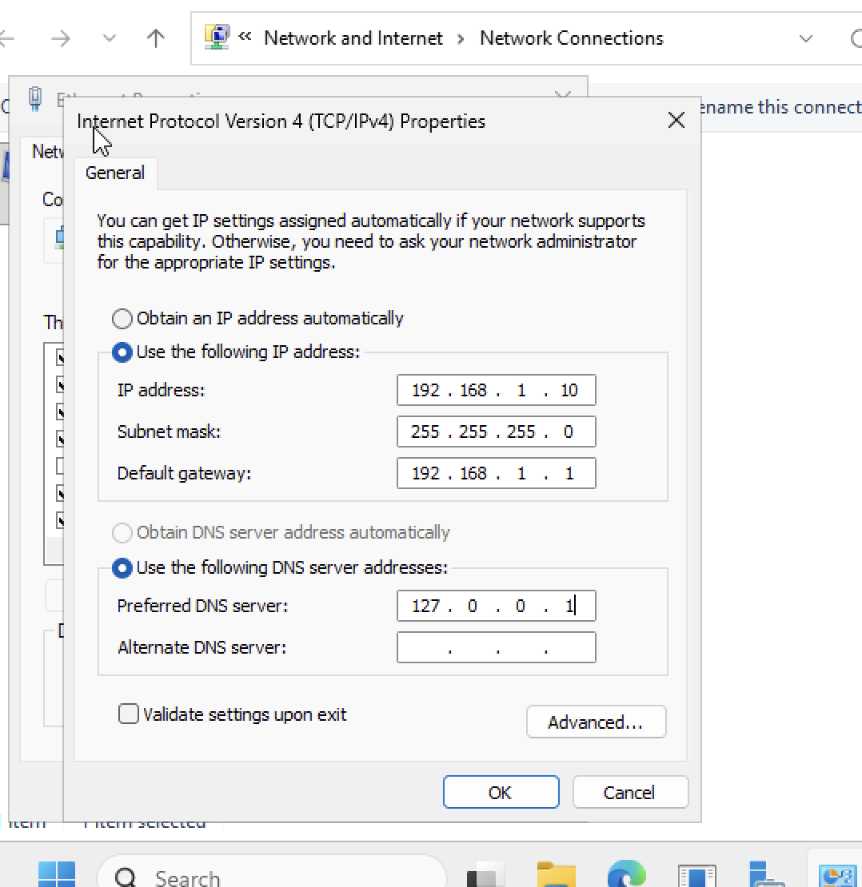

---

### 4️⃣ Install and Configure Active Directory
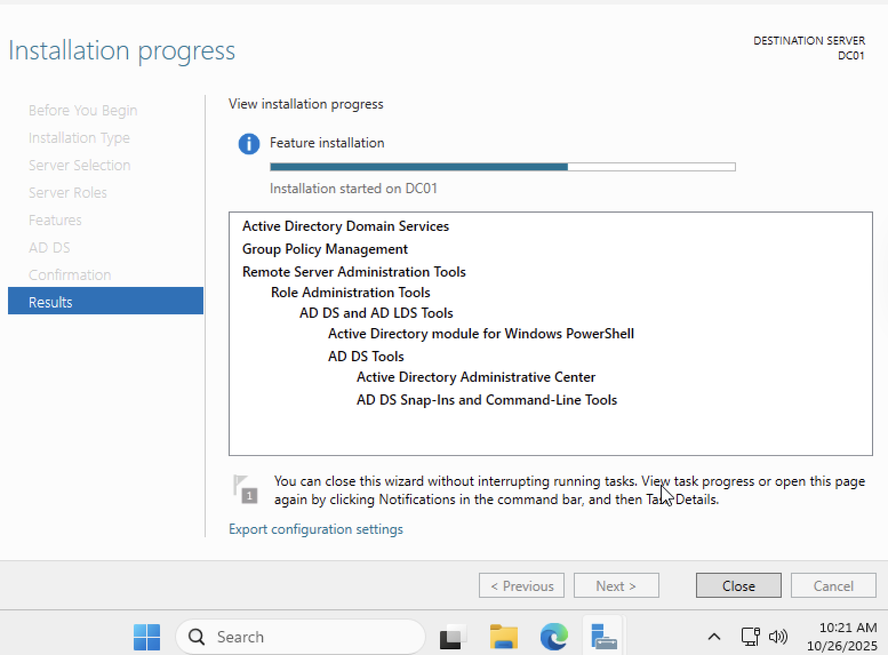
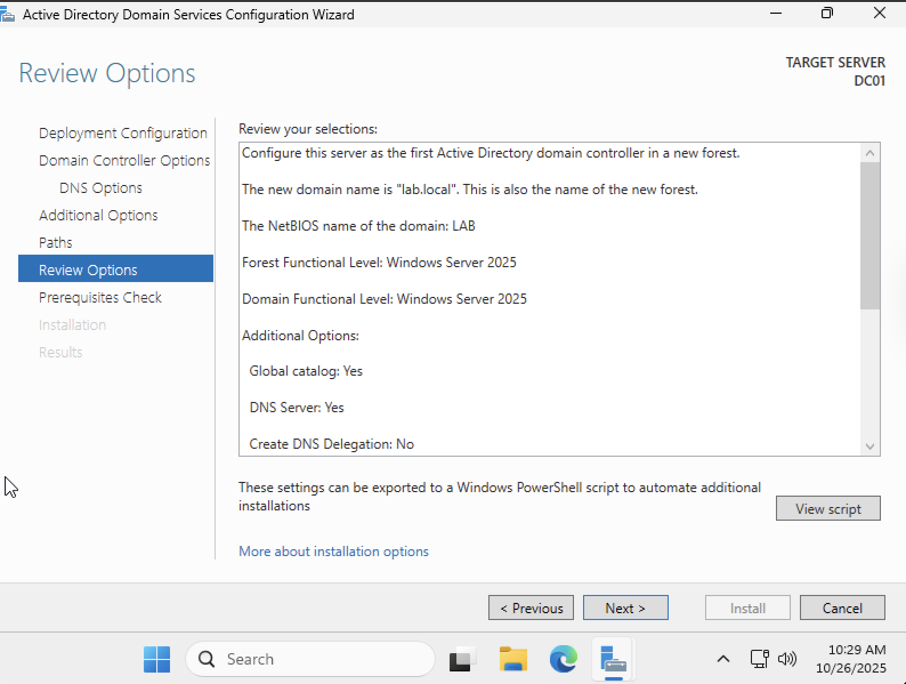
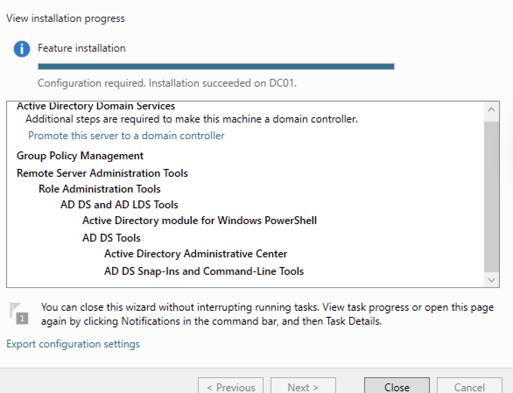

---

### 5️⃣ Verify Domain Controller Login
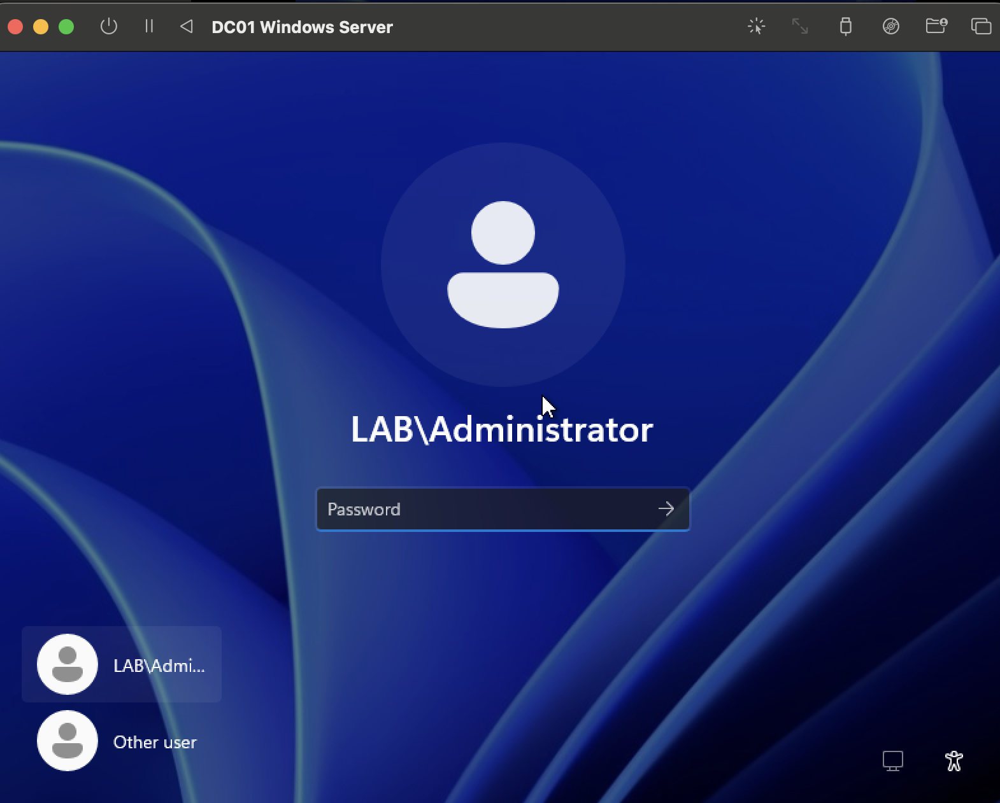

---

## ✅ Outcome

By the end of this lab:
- The server was successfully renamed to **DC01**
- Networking was configured with static IP and internal DNS
- Active Directory Domain Services were installed and promoted
- Domain controller verified via **LAB\Administrator** login

---

---

## 🧠 Skills Demonstrated

- Windows Server installation and configuration  
- Virtualization setup using UTM  
- Static IP and DNS setup  
- Active Directory Domain Services configuration  
- Domain controller promotion  
- Administrative login validation  

---

## 🪪 Author
**Luis C. Mejia**  
🖥️ [GitHub: ChrisCyberTech](https://github.com/ChrisCyberTech)

---

